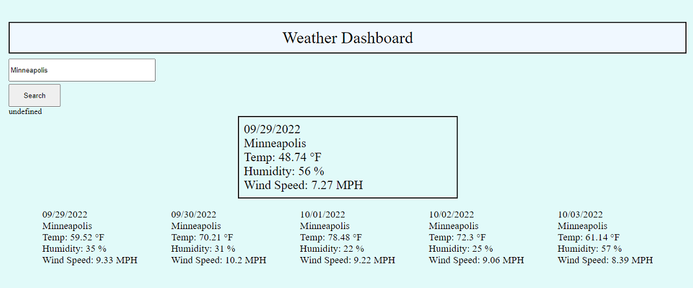

# Weather Dashboard

## Description

The goal of this assignment was to create a weather dashboard that allows the user to search a city within the US and receieve back the current weather along with the 5 day forecast.

https://theinterloper.github.io/06-weather-dashboard/

## Installation

N/A

## Usage

Search US cities to get weather information.

## Credits

N/A

## License

N/A
